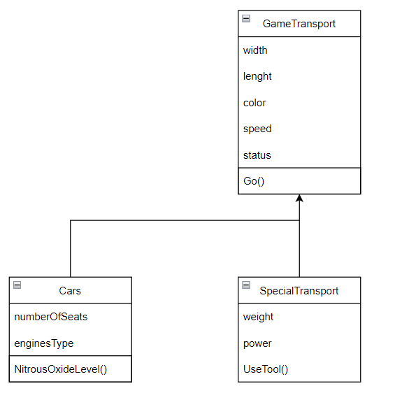

В этом практическом занятиии я научился создавать классы,
изучил наследование, полипорфизм и инкапсуляцию. Так же поработал с абстрактными классами и интерфейсами.
Работа составлена в соответствии с данной схемой.
